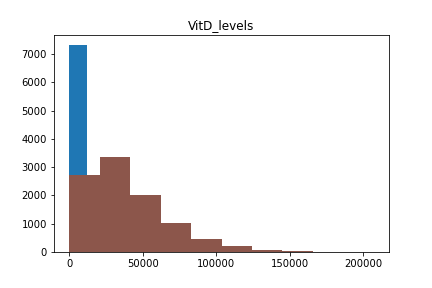
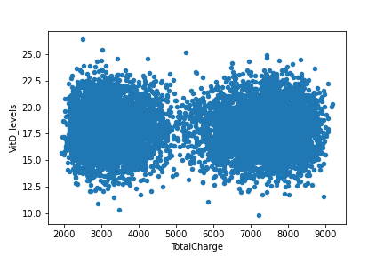
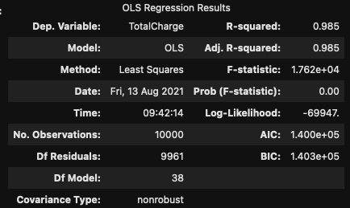
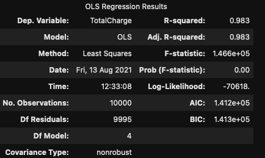
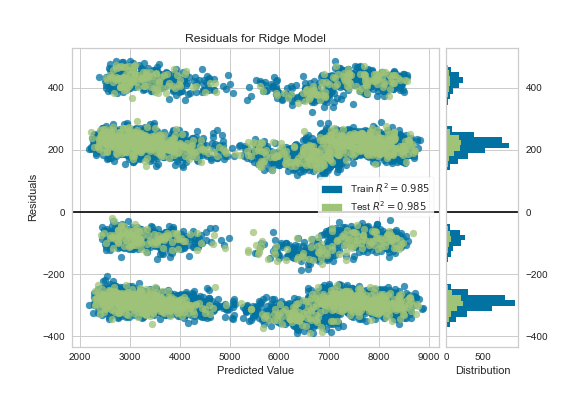

Using Multiple Linear Regression to predict Total Charge of a hospital stay
---

# Introduction


## Research question

The purpose of our research will be to build a model for predicting the total charge of a patient's stay at a hospital. We will look at patient demographics and health conditions to make this prediction.

We're making the assumption that the data we are using is clean and valid.

Multiple Linear regression is an appropriate technique for this question because we are looking to predict a numerical outcome using many contributing variables.

We should take into account the four assumptions of Multiple Linear Regression:
1. Variables are normally distributed
2. There is a linear relationship between the independent and dependent variables
3. The variables are measured without error
4. The variables have the same finite variance

## Tools

Python in Jupyterlab was used to write the code for this analysis. There are many statistics libraries written in python that make what we are planning to do very simple:
- ``Numpy`` and ``pandas`` for standard dataframe and numerical operations
- ``Sklearn`` and ``statsmodels`` for building the regression models
- ``matplotlib``, ``yellowbrick``, and ``sns`` for visualizations. 

The code can be found in the notebook ``multiple-linear-regression.ipynb`` or in script form in ``multiple-linear-regression.py``.

# Data Preparation

We begin the data preparation by removing irrelevant variables. We removed the following:
- CaseOrder
- Customer_id
- Interaction
- UID
- City
- State
- County
- Zip
- Lat
- Lng
- Interaction
- TimeZone
- Additional_charges

```python
df = df.drop(['CaseOrder', 'Customer_id', 'Interaction', 'UID', 'City', 'State', 'County', 'Zip', 'Lat', 'Lng', 'Interaction', 'TimeZone', 'Additional_charges'], axis=1)
```

We then convert the categorical values to numeric.

```python
cat_columns = df.select_dtypes(exclude="number").columns

# Give categorical columns a numeric value
for col in cat_columns:
    df[col] = pd.Categorical(df[col])
    df[col] = df[col].cat.codes
```


## Summary Statistics

We are working with 10,000 observations.

Our target variable (``y``) is ``TotalCharge`` which is a continuous numeric, and our initial set of predictor variables (``X``) are:

Feature | Type
--- | ---
Population | numeric
Area | categorical
Job | categorical
Children| numeric
Age| numeric
Income| numeric
Marital| categorical
Gender| categorical
ReAdmis| categorical
VitD_levels| numeric
Doc_visits| numeric
Full_meals_eaten| numeric
vitD_supp| numeric
Soft_drink| categorical
Initial_admin| categorical
HighBlood| categorical
Stroke| categorical
Complication_risk| categorical
Overweight| categorical
Arthritis| categorical
Diabetes| categorical
Hyperlipidemia| categorical
BackPain| categorical
Anxiety| categorical
Allergic_rhinitis| categorical
Reflux_esophagitis| categorical
Asthma| categorical
Services| categorical
Initial_days| numeric
Item1| categorical
Item2| categorical
Item3| categorical
Item4| categorical
Item5| categorical
Item6| categorical
Item7| categorical
Item8| categorical

```python
target = 'TotalCharge'

X = df.loc[:,df.columns!=target]
y = df[target]
```
There a lot of variables here, but they will be reduced later on.

The modified dataset can be found in ``data/medical_prepared.csv``

### Central Tendancy

We look at the central tendancy of the target as well as one of our predictors, ``VitD_levels``.
```python
print('The mean of %s is: %s' % (target, y.mean()))
print('The mean of %s is: %s' % ('VitD_levels', df['VitD_levels'].mean()))
```
Output:
```bash
The mean of TotalCharge is: 5312.172768750177
The mean of VitD_levels is: 17.964261654862938
```

## Univariate Analysis

We perform univariate analysis on our variables. Here is the plot for ``VitD_levels``



## Bivariate Analysis

Here is a bivariate plot of ``VitD_levels`` compared to ``TotalCharge``



# Models

## Initial Model

First we construct a model using all of the variables we picked out:

```python
Xc = sm.add_constant(X)

initial_model = sm.OLS(y,Xc)
results = initial_model.fit()
results.summary()
```


## Reduction

We'll use a reduction technique called "Backward Elimination", in which we start by training a model with all of our variables then remove variables one by one until we have removed the inconsequential ones.

The code below itterably trains a linear model then scores it using the AIC metric, removing a variable at each step until only the relevant variables are left.

```python
# Adapted from lesson 3.3 of predictive modeling notes
linear_regression = LinearRegression(normalize=False,fit_intercept=True)

# Scores a model for a given X, y pair
def r2_est(X,y):
    return r2_score(y,linear_regression.fit(X,y).predict(X))

# Make a list of all features and their impact on the r2 score
r2_impact = list()
for j in range(X.shape[1]):
    selection = [i for i in range(X.shape[1]) if i!=j]
    r2_impact.append(((r2_est(X,y) - r2_est(X.values [:,selection],y)) ,X.columns[j]))

# Make a list of the most impactful features called 'best_variables'
best_variables = list()
for imp, varname in sorted(r2_impact, reverse=True):
    if imp >= 0.001:
        best_variables.append(varname)
    print ('%6.3f %s' %  (imp, varname))
```

We end up with a reduced variable set consisting of:
- Initial_days
- Complication_risk
- HighBlood
- Hyperlipidemia

The reduced set can be found in ``data/medical_reduced.csv``

### The Reduced Model

```python
X_reduced = df_reduced.loc[:,df_reduced.columns!=target]
Xc_reduced = sm.add_constant(X_reduced)

model_reduced = sm.OLS(y,Xc_reduced)
results = model_reduced.fit()
results.summary()
```


We were able to get similar accuracy with only 4 of the original variables!

## Residuals


```python
X_train, X_test, y_train, y_test = train_test_split(X, y, test_size=0.2)

model = Ridge()
visualizer = ResidualsPlot(model)
visualizer.fit(X_train, y_train)
visualizer.score(X_test, y_test)
residual = visualizer.poof()
```


# Summary

## Coefficients

Here is a table of the coefficients, sorted by absolute value:

Coefficient | Variable 
--- | ---
-202.0708 | Complication_risk
118.2329 | HighBlood
103.9143 | Hyperlipidemia
81.8533 | Initial_days

It seems that ``Complication_risk`` is the most influential variable at play.


## Regression Equation

```
TotalCharge = 2633.9585 + 81.8533(Initial_days) + (-202.0708)(Complication_risk) + 118.2329(HighBlood) + 103.9143(Hyperlipidemia)
```

## Statistical significance

We were able to get within 2 thousandths of the accuracy of the full model with only the 4 variables we reduced too, which is an inconsequential change. With this information we now know that if a hospital wants to estimate the total cost of a visit they need only look at ta patient's Complication risk, whether they have high blood pressure, whether they have Hyperlipidemia, and how many days they are projected to stay.

## Limitations

With only 10,000 patient records to work with there is a chance this model has been biased towards a particular conclusion. For example in another set of patients a different pre-existing condition such as Anxiety may contribute more to total cost.

## Recommendations

Pay close attention to the complication risk, high blood pressure, and Hyperlipidemia in patients as well as how long they are projected to be in the hospital in order to calculate the cost of a visit.