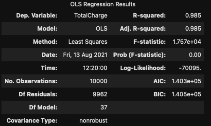

Using Multiple Linear Regression to predict Total Charge of a hospital stay
---

# Introduction


## Research question

The of our research will be to build a model for predicting the total charge of a patient's stay at a hospital. We will look at patient demographics and health conditions to make this prediction.

We're making the assumption that the data we are using is clean and valid.

Multiple Linear regression is an appropriate technique for this question because we are looking to predict a numerical outcome using many contributing variables.

## Tools

Python in Jupyterlab was used to write the code for this analysis. The code can be found in the notebook ``multiple-linear-regression.ipynb`` or in script form in ``multiple-linear-regression.py``.

### Libraries

``Numpy`` and ``pandas`` were used for standard dataframe and numerical operations. ``Sklearn`` and ``statsmodels`` were used for building the regression models. ``matplotlib`` and ``yellowbrick`` were used for visualizations. ``dmba`` was used for the purpose of data reduction.


# Data Preparation

We begin the data preparation by removing irrelevant variables. We removed the following:
- CaseOrder
- Customer_id
- Interaction
- UID
- City
- State
- County
- Zip
- Lat
- Lng
- Interaction
- TimeZone
- Additional_charges

```python
df = df.drop(['CaseOrder', 'Customer_id', 'Interaction', 'UID', 'City', 'State', 'County', 'Zip', 'Lat', 'Lng', 'Interaction', 'TimeZone', 'Additional_charges'], axis=1)
```

We then convert the categorical values to numeric.

```python
cat_columns = df.select_dtypes(exclude="number").columns

# Give categorical columns a numeric value
for col in cat_columns:
    df[col] = pd.Categorical(df[col])
    df[col] = df[col].cat.codes
```

Our target variable (``y``) is ``TotalCharge``, and our initial set of predictor variables (``X``) are:
- Population
- Area
- Job
- Children
- Age
- Income
- Marital
- Gender
- ReAdmis
- VitD_levels
- Doc_visits
- Full_meals_eaten
- vitD_supp
- Soft_drink
- Initial_admin
- HighBlood
- Stroke
- Complication_risk
- Overweight
- Arthritis
- Diabetes
- Hyperlipidemia
- BackPain
- Anxiety
- Allergic_rhinitis
- Reflux_esophagitis
- Asthma
- Services
- Initial_days
- Item1
- Item2
- Item3
- Item4
- Item5
- Item6
- Item7
- Item8

```python
outcome = 'TotalCharge'

X = df.loc[:,df.columns!=outcome]
y = df[outcome]
```
There a lot of variables here, but they will be reduced later on.

The modified dataset can be found in ``data/medical_prepared.csv``

## Univariate Analysis

We perform univariate analysis on our variables. Here is the plot for ``VitD_levels``


This plot as well as the plots for the rest of the univariate analysis can be round in ``plots/`` with the prefix "univariate".

## Bivariate Analysis

Here is a bivariate plot of ``VitD_levels`` compared to ``TotalCharge``


The rest of the bivariate pltos can be found in ``plots/`` with the prefix "bivariate".

# Models

## Initial Model

First we construct a model using all of the variables we picked out:

```python
Xc = sm.add_constant(X)

initial_model = sm.OLS(y,Xc)
results = initial_model.fit()
results.summary()
```


## Reduction

We'll use a reduction technique called "Backward Elimination", in which we start by training a model with all of our variables then remove variables one by one until we have removed the inconsequential ones.

```python
# adapted from Chapter4 of "Practical Statistics for Data Scientists" 
# by Bruce, Bruce, and Gedeck

from dmba import backward_elimination, AIC_score
from sklearn.linear_model import LinearRegression

def train_model(variables):
    if len(variables) == 0:
        return None
    model = LinearRegression()
    model.fit(X[variables], y)
    return model

def score_model(model, variables):
    if len(variables) == 0:
        return AIC_score(y, model.predict(df[y]))
    return AIC_score(y, model.predict(X[variables]), model)

best_model, best_variables = backward_elimination(X.columns, train_model, score_model, verbose=True)
```

We end up with a reduced variable set consisting of:
- Income
- ReAdmis
- VitD_levels
- Soft_drink
- HighBlood
- Complication_risk
- Arthritis
- Diabetes
- Hyperlipidemia
- BackPain
- Anxiety
- Allergic_rhinitis
- Reflux_esophagitis
- Initial_days
- Item5
- Item6

The reduced set can be found in ``data/medical_reduced.csv``

### The Reduced Model

```python
X_reduced = df_reduced.loc[:,df_reduced.columns!=outcome]
Xc_reduced = sm.add_constant(X_reduced)

model_reduced = sm.OLS(y,Xc_reduced)
results = model_reduced.fit()
results.summary()
```


## Residuals


```python
X_train, X_test, y_train, y_test = train_test_split(X, y, test_size=0.2)

model = Ridge()
visualizer = ResidualsPlot(model)
visualizer.fit(X_train, y_train)
visualizer.score(X_test, y_test)
residual = visualizer.poof()
```


